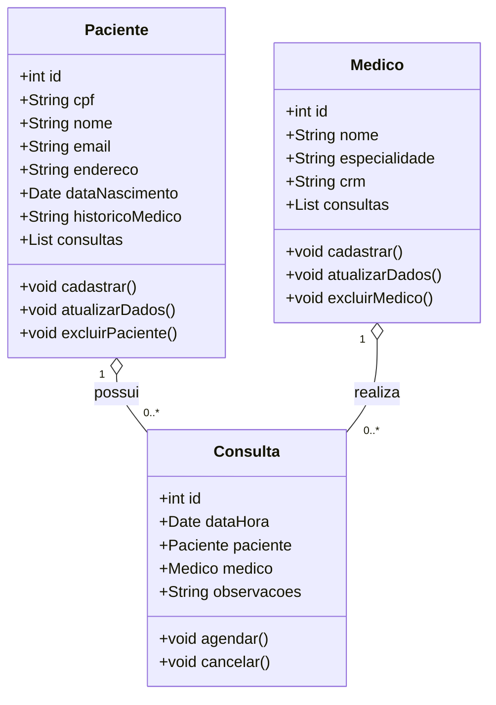
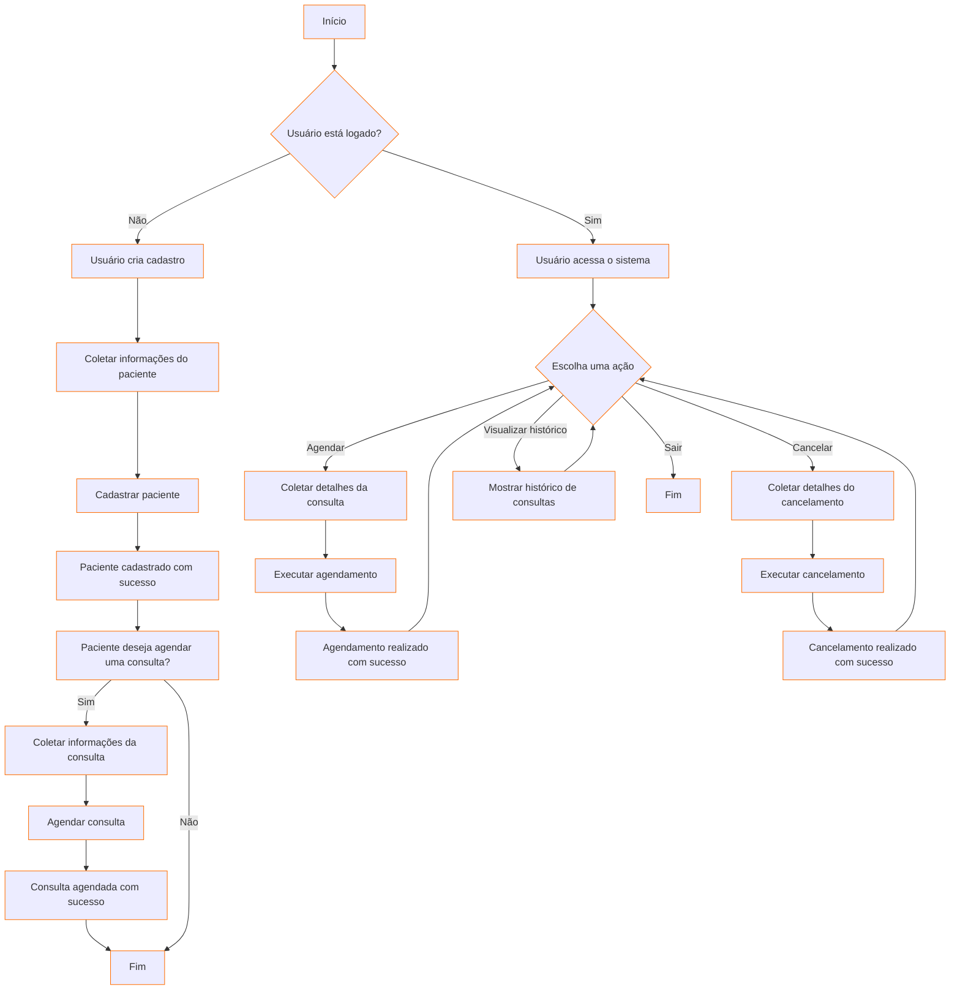

# Sistema "Clínica Saúde"

### **Projeto:**

Sistema de Gerenciamento de Clínica Médica

### **Descrição do Projeto:**

O Sistema de Gerenciamento de Clínica Médica "Clínica Saúde" será uma aplicação destinada a gerenciar as operações de uma clínica médica. O projeto incluirá funcionalidades como cadastro de pacientes, agendamento de consultas, gerenciamento de médicos e registros de atendimentos.
    

     
- **Escopo:**
    
    **Sistema será capaz de:**

    - **Cadastrar:**
    Pacientes poderão visualizar um formulário para registrar suas informações, como: CPF, nome, endereço,      telefone, e-mail, data de nascimento e histórico médico.
    

    - **Logar:**
    Pacientes e profissionais de saúde poderão autenticar-se para acessar suas áreas específicas do sistema     usando CPF e senha.
    

    - **Gerenciamento de Pacientes:**
    Os profissionais de saúde poderão visualizar e atualizar informações dos pacientes, como histórico de       consultas e tratamentos.
    

    - **Agendamento de Consultas:**
    Permitir que os pacientes agendem consultas, visualizem horários disponíveis e recebam confirmações de      agendamentos.
    

    - **Atendimentos:**
    Registro de atendimentos médicos, incluindo anotações sobre diagnósticos, prescrições e orientações         dadas aos pacientes.
  

 

- **Recursos/Requisitos:**
    - **Ferramentas de Desenvolvimento:**
        - IDE: Visual Studio Code com extensões para Java Swing tendo suporte para o maven.

    - **Tecnologias:**
        - Frontend: Java Swing para o desenvolvimento da interface gráfica.
        - Backend: Java com integração ao banco de dados e lógica de negócio.
        - Banco de Dados: MongoDB para armazenamento de dados não relacionais.

### **Diagramas**

**Diagrama de Classe:**

**Diagrama de Fluxo:**

**Diagrama de Uso:**
