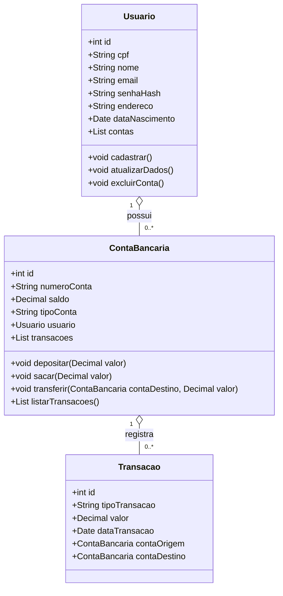
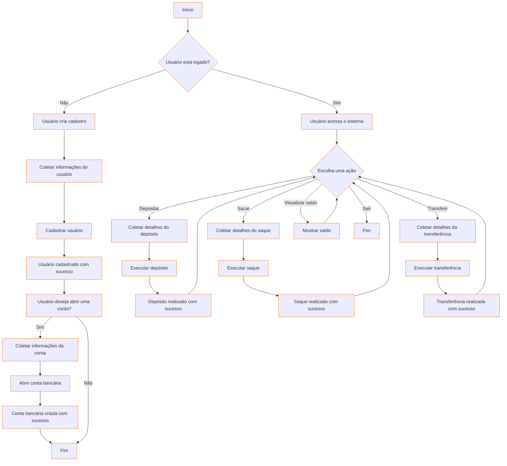

# Sistema "Itaú"

### **Projeto:**

Sistema de Gerenciamento Bancário

### **Descrição do Projeto:**

O Sistema de Gerenciamento Bancário Itaú será uma aplicação para simular as funcionalidades de um sistema bancário. O projeto abrangerá desde o cadastro de usuários até operações bancárias como consultas de saldo, transferências e histórico de transações.
    

     
- **Escopo:**
    
     **Sistema será capaz de:**
        
    - **Cadastrar:**
        Usuários irão visualizar um formulário para cadastrar suas informações, como: cpf, nome, senha, endereço, telefone, e-mail, data de nascimento.
        

    - **Logar:**
        Poderão também fazer a autenticação para entrar no sistema. Deverá ser digitado as informações de cpf e senha para a entrada.
        

    - **Gerenciamento da Conta:**
        
        Tipos de contas: Conta Corrente, Conta Poupança.
        Saldo inicial configurável.
        Consulta de Saldo: Permitir que os     usuários verifiquem o saldo de suas contas.
        

    - **Operações Bancárias:**
        
        Depósito: Permitir que o usuário faça depósitos em sua conta.

        Saque: Permitir que o usuário realize saques (com validação de saldo suficiente).
        
        Transferências entre Contas: Implementar transferências entre contas do mesmo banco.
    
     
    
    

     
- **Recursos/Requisitos:**
    - **Ferramentas de Desenvolvimento:**
        - IDE: Visual Studio Code com extensões para Java Swing tendo suporte para o maven.

    - **Tecnologias:**
        - Frontend: Java Swing para o desenvolvimento da interface gráfica.
        - Backend: Java com integração ao banco de dados e lógica de negócio.
        - Banco de Dados: PostgreSQL para armazenamento de dados relacionais.

### **Diagramas**

**Diagrama de Classe:**

**Diagrama de Fluxo:**

